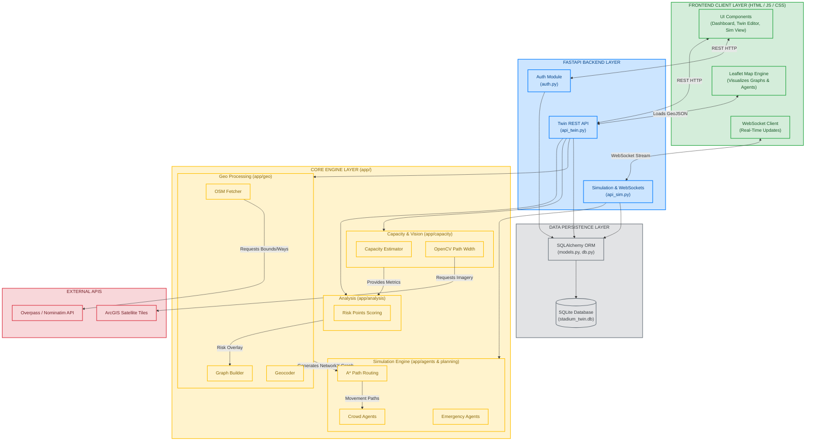

# FlowGuard (StadiumTwin v2) Block Architecture

This document provides a detailed block diagram of the FlowGuard system architecture.

## Layer Definitions

1. **Frontend Client Layer**: The presentation tier running in the browser. It handles interactive mapping (Leaflet), UI forms for parameters, and establishes a WebSocket connection for a smooth 60FPS simulation feed.
2. **FastAPI Backend Layer**: Acts as the central controller. It exposes REST API endpoints for state mutations and a WebSocket manager that broadcasts live agent coordinates to connected clients.
3. **Core Engine Layer**: The domain logic, heavily compartmentalized:
   - **Geo**: Pulls raw OSM data and translates it into a mathematical `NetworkX` graph.
   - **Capacity & Vision**: Runs geometric estimations (Shoelace) and Computer Vision pipelines (OpenCV satellite imagery) to augment data.
   - **Analysis**: Cross-references graph metrics (centrality) with geometrical constraints to generate risk scores.
   - **Simulation**: Agent-based modeling loop managing individual agent lifecycles, velocities, dynamic obstacle avoidance, and A* routing.
4. **Data Persistence Layer**: Synchronous `SQLAlchemy` ORM mapping models (Users, Twins) to a local SQLite database for local deployments.
5. **External APIs**: Third-party geographic providers necessary to build the accurate digital twin foundation.
